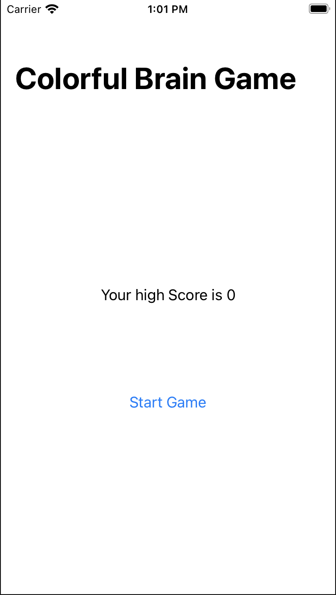
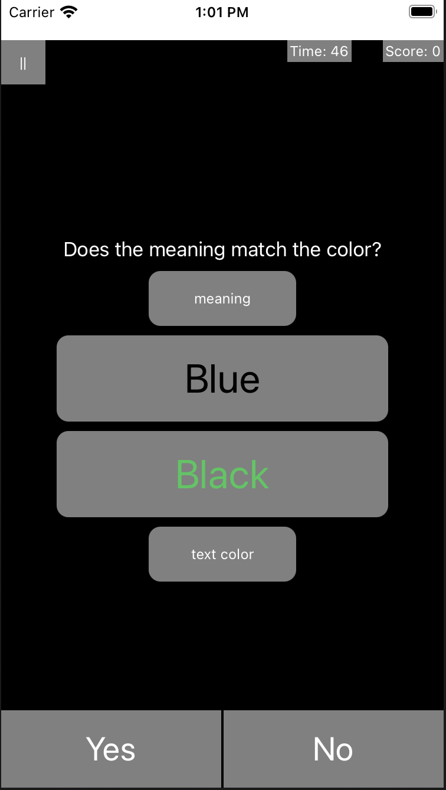
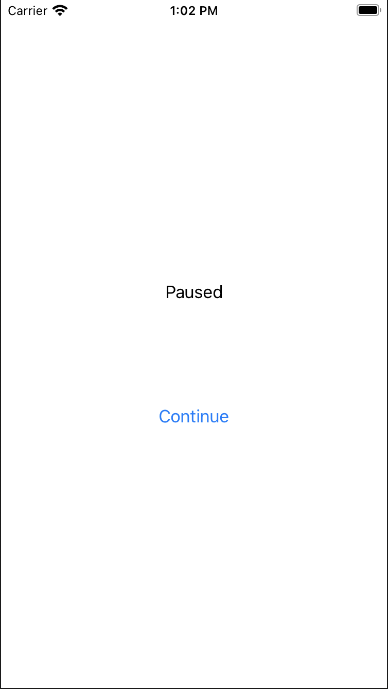

# Brain Training App

This application is written in swift using SwiftUi. It provides a simple user inerface and one of those fun "Brain Training" games. There is not a lot of research that shows that this actually inporves cognitive ability, but if you do practice this you will get better at it.

The goal of the game is to answer yes or no to whether the meaning of the top word matches the color of the botom word.

If you have Xcode on your computer you should be able to download the project and test it out locally. It is not deployed anywhere.